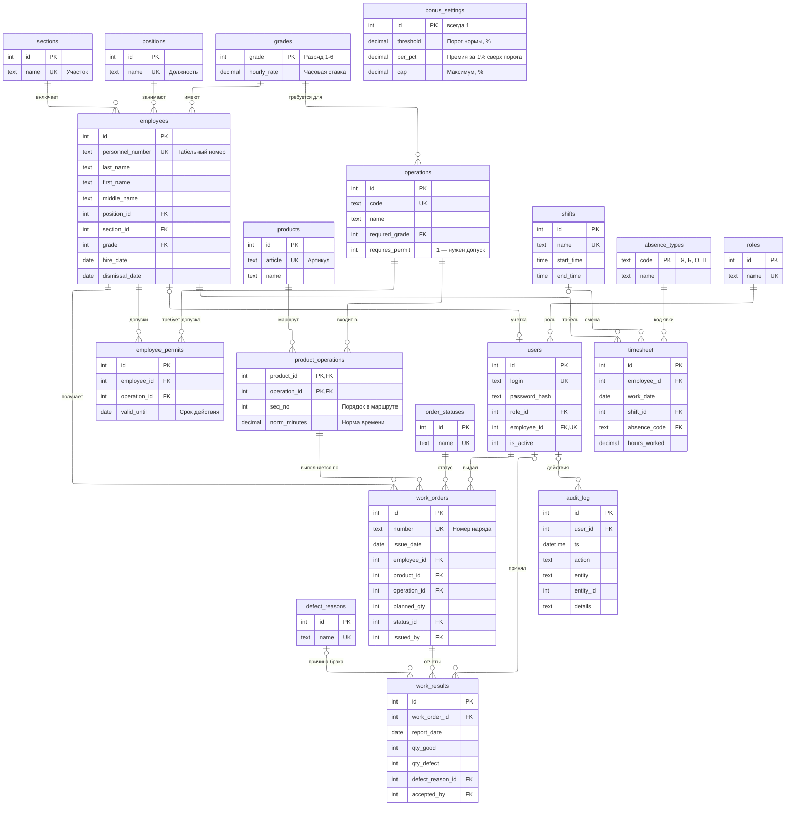

# ER-диаграмма БД

```mermaid
---
config:
  layout: elk
  elk:
    mergeEdges: false
    nodePlacementStrategy: NETWORK_SIMPLEX
---
erDiagram
    sections {
        int  id PK
        text name UK "Участок"
    }
    positions {
        int  id PK
        text name UK "Должность"
    }
    grades {
        int     grade PK "Разряд 1-6"
        decimal hourly_rate "Часовая ставка"
    }
    employees {
        int  id PK
        text personnel_number UK "Табельный номер"
        text last_name
        text first_name
        text middle_name
        int  position_id FK
        int  section_id FK
        int  grade FK
        date hire_date
        date dismissal_date
    }
    products {
        int  id PK
        text article UK "Артикул"
        text name
    }
    operations {
        int  id PK
        text code UK
        text name
        int  required_grade FK
        int  requires_permit "1 — нужен допуск"
    }
    employee_permits {
        int  id PK
        int  employee_id FK
        int  operation_id FK
        date valid_until "Срок действия"
    }
    bonus_settings {
        int     id PK "всегда 1"
        decimal threshold "Порог нормы, %"
        decimal per_pct "Премия за 1% сверх порога"
        decimal cap "Максимум, %"
    }
    product_operations {
        int     product_id PK, FK
        int     operation_id PK, FK
        int     seq_no "Порядок в маршруте"
        decimal norm_minutes "Норма времени"
    }
    shifts {
        int  id PK
        text name UK
        time start_time
        time end_time
    }
    absence_types {
        text code PK "Я, Б, О, П"
        text name
    }
    order_statuses {
        int  id PK
        text name UK
    }
    defect_reasons {
        int  id PK
        text name UK
    }
    roles {
        int  id PK
        text name UK
    }
    users {
        int  id PK
        text login UK
        text password_hash
        int  role_id FK
        int  employee_id FK, UK
        int  is_active
    }
    timesheet {
        int     id PK
        int     employee_id FK
        date    work_date
        int     shift_id FK
        text    absence_code FK
        decimal hours_worked
    }
    work_orders {
        int  id PK
        text number UK "Номер наряда"
        date issue_date
        int  employee_id FK
        int  product_id FK
        int  operation_id FK
        int  planned_qty
        int  status_id FK
        int  issued_by FK
    }
    work_results {
        int  id PK
        int  work_order_id FK
        date report_date
        int  qty_good
        int  qty_defect
        int  defect_reason_id FK
        int  accepted_by FK
    }
    audit_log {
        int      id PK
        int      user_id FK
        datetime ts
        text     action
        text     entity
        int      entity_id
        text     details
    }

    sections           ||--o{ employees          : "включает"
    positions          ||--o{ employees          : "занимают"
    grades             ||--o{ employees          : "имеют"
    grades             ||--o{ operations         : "требуется для"
    products           ||--o{ product_operations : "маршрут"
    operations         ||--o{ product_operations : "входит в"
    product_operations ||--o{ work_orders        : "выполняется по"
    employees          ||--o{ work_orders        : "получает"
    order_statuses     ||--o{ work_orders        : "статус"
    users              ||--o{ work_orders        : "выдал"
    work_orders        ||--o{ work_results       : "отчёты"
    defect_reasons     |o--o{ work_results       : "причина брака"
    users              |o--o{ work_results       : "принял"
    employees          ||--o{ timesheet          : "табель"
    shifts             |o--o{ timesheet          : "смена"
    absence_types      ||--o{ timesheet          : "код явки"
    roles              ||--o{ users              : "роль"
    employees          |o--o| users              : "учётка"
    users              |o--o{ audit_log          : "действия"
    employees          ||--o{ employee_permits   : "допуски"
    operations         ||--o{ employee_permits   : "требует допуска"
```
